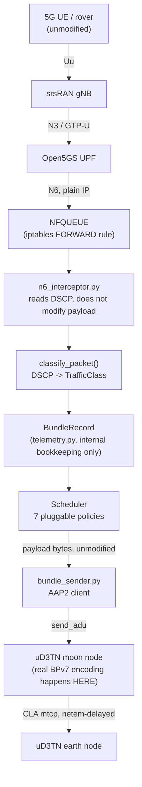
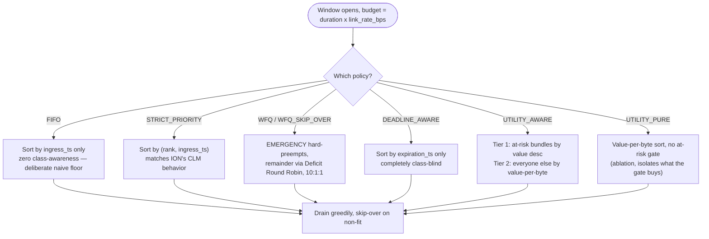

# LunaBridge

A 5G-to-DTN gateway for lunar surface communications. A rover uses ordinary 5G, unaware that Earth is only reachable during intermittent satellite contact windows where, LunaBridge sits at the network edge, captures that traffic transparently, holds it through blackouts, and forwards it as real DTN bundles once a relay pass opens.


## Table of contents

- [The problem this solves](#the-problem-this-solves)
- [Architecture and data flow](#architecture-and-data-flow)
- [Module breakdown](#module-breakdown)
- [The TTL redesign — and why the original numbers were meaningless](#the-ttl-redesign--and-why-the-original-numbers-were-meaningless)
- [Seven scheduling policies](#seven-scheduling-policies)
- [What the figures actually found](#what-the-figures-actually-found)
- [DTN integration — the real story, bugs included](#dtn-integration--the-real-story-bugs-included)
- [A note on AI-assisted development](#a-note-on-ai-assisted-development)
- [Reproducing this](#reproducing-this)
- [Repository layout](#repository-layout)
- [Known issues](#known-issues)

## The problem this solves

3GPP 5G assumes continuous backhaul. A lunar relay doesn't provide that, and therefore, using a real GMAT-propagated 90-day orbit (LCRNS SV-1, single-satellite degraded scenario), the relay is visible for stretches of roughly 25 hours, then drops out for gaps up to 5.56 hours. A rover running stock 5G software has no idea any of this is happening, and nothing in the 3GPP stack is built to survive a multi-hour blackout gracefully.

LunaBridge doesn't touch the rover. It sits at the 5G core's N6 egress, which is the boundary where the core hands traffic off to "whatever's outside" and does the translation work there: capture, classify, hold through the gap, forward as a DTN bundle when the link comes back.

```
UE (rover) -> gNB -> Open5GS 5G core -> N6 -> LunaBridge -> BPv7 bundle -> uD3TN -> relay -> Earth
```

## Architecture and data flow



One thing worth being precise about to get straight: the packet's actual bytes never change as they move through the Python layers above. They're read once (for DSCP), then carried forward untouched, picking up metadata along the way. The only place real BPv7 encoding happens is inside `uD3TN` itself, in C, the instant `send_adu()` is called. Everything before that is bookkeeping.

## Module breakdown

- **`gateway/n6_interceptor.py`** — binds to NFQUEUE, reads DSCP off the raw IP header (`(payload[1] >> 2) & 0x3F` for IPv4; IPv6's Traffic Class is split across two bytes and has to be reassembled first — RFC 8200 splits it as low-nibble-of-byte-0 + high-nibble-of-byte-1, unlike IPv4's clean single byte). Always issues `ACCEPT` in a `finally` block — a parse crash can never wedge the kernel queue.
- **`gateway/traffic.py`** — the taxonomy. Four classes (down from an original seven), each with a rank, a utility weight, and a TTL. Single source of truth — everything else imports from here.
- **`gateway/telemetry.py`** — `BundleRecord`, tracking lifecycle state: `PENDING -> DELIVERED / TTL_EXPIRED / QUEUE_OVERFLOW / NEVER_SCHEDULED`. Explicitly *not* BPv7 encoding — the module docstring says so directly, because it matters: this is internal state, and conflating it with the wire format was an easy mistake to almost make.
- **`gateway/contact_plan.py`** — `ContactWindow`/`ContactPlan`, loaded from the real GMAT-propagated 90-day contact plan CSV (`start_sec`/`end_sec`/`rate_bps` columns — confirmed these are seconds-since-plan-epoch, not Unix time, by checking that `gap_before_s` for the first row matches `start_sec` almost exactly).
- **`gateway/scheduler.py`** — seven scheduling policies, described below.
- **`gateway/workload_generator.py`** — Poisson-arrival synthetic traffic, one shared random seed across all four classes so every policy is tested against identical traffic.
- **`gateway/sweep_harness.py`** — runs the scheduler repeatedly across parameter sweeps (congestion multiplier R, per-class TTL) to produce the comparison data behind every figure.
- **`gateway/bundle_sender.py`** — the actual handoff to uD3TN, over its real AAP2 API.

## The TTL redesign — and why the original numbers were meaningless

The original four TTLs looked reasonable individually, but turned out to be one number wearing four costumes. All four were exact multiples of the same base value (23627s — the contact plan's max blackout gap plus a 1-hour margin):

| Class | Old TTL | Multiplier |
|---|---|---|
| MEDIA | 11,813s | 0.5x |
| EMERGENCY | 23,627s | 1x |
| TELEMETRY | 47,254s | 2x (exact) |
| SCIENCE_BULK | 165,389s | 7x (exact) |

Every class's deadline was anchored to the *same* orbital-mechanics fact. Change the contact plan, and all four move together, regardless of whether the underlying traffic got more or less urgent. That's not decoupled — that's a "trivially tied regime," and it meant no scheduling policy comparison could ever show real differentiation, because TTL-vs-gap survival (which is policy-blind by the scheduler's own design) was doing all the work.

The fix is grounded in RFC 9171 itself — the standard's own Lifetime field is defined as marking when a bundle's payload *stops being useful*, not as a function of the link. Redesigned per-class, independently:

| Class | New TTL | Reasoning |
|---|---|---|
| EMERGENCY | 300s | Ground-escalation window — the truly split-second crew response is onboard and never touches this relay (confirmed by checking a real ISS depressurization procedure, which uses a ~10-minute onboard decision threshold); what crosses the relay is ground notification during an active situation. |
| TELEMETRY | 3,600s | Tied to sampling cadence, not orbital gap. |
| SCIENCE_BULK | 57,600s | Buffer-depth × arrival-rate derived, not gap-derived. |
| MEDIA | 3,600s | General relevance decay — deliberately *not* EVA-specific, since "media could be anything, generated at any time" isn't a claim the taxonomy can defend restricting. |

## Seven scheduling policies

The scheduler exists because bandwidth during a contact window is finite and multiple traffic classes compete for it. All seven are testable against the identical plan/workload/queue-cap for a real comparison.



**FIFO** — genuinely naive, no class awareness at all. Exists as a floor: this is what happens with zero prioritization, and it's the baseline every other policy needs to beat.

**STRICT_PRIORITY** — fixed rank order, matches how real DTN implementations (ION's CLM) already schedule. The default.

**WFQ / WFQ_SKIP_OVER** — EMERGENCY always preempts; the rest fair-share via Deficit Round Robin (Shreedhar & Varghese, 1996), weighted 10:1:1. `WFQ_SKIP_OVER` is an experimental variant that scans past a non-fitting head-of-line bundle instead of ending that class's turn for the round — not backed by DRR's original fairness proof, flagged as our own variant.

**DEADLINE_AWARE** — true Earliest-Deadline-First, deliberately with no EMERGENCY exception. This is the important part: it's genuinely urgency-aware but value-blind, and we proved it by hand before trusting it at scale, where we constructed a scenario where a low-value TELEMETRY bundle is marginally more urgent than a high-value EMERGENCY bundle, and EDF will sacrifice the EMERGENCY bundle every time, purely on deadline order. That's not a bug, it's the honest cost of pure deadline scheduling and it shows up in the full-scale stress-test results too, not just the constructed example.

**UTILITY_AWARE** — the actual contribution. Two tiers: bundles that are *at-risk* (will die before the next contact window opens, regardless of what happens now) get scheduled first, sorted by mission value; everything else gets sorted by value-per-byte. One thing worth being upfront about: a naive "just sort everything by value" collapses into being identical to STRICT_PRIORITY for this project's actual numbers, since value-per-byte never inverts class rank here. The real differentiator isn't the value sort. It's the at-risk gate specifically, which is why it needed the ablation below to actually prove that.

**UTILITY_PURE** — the ablation. Same value-per-byte sort, but with the at-risk gate removed. Built specifically to isolate how much of `UTILITY_AWARE`'s behavior the gate is actually responsible for, not the sorting itself.

## What the figures actually found

**Bandwidth almost never mattered — and that's itself a real finding.** Under the real 90-day contact plan (10 Mbps link, ~25-hour average window), every one of the seven policies produces *identical* results, at every traffic volume we tested. Not a bug: a single real window can carry 27-111 GB depending on duration, which dwarfs the entire 90-day traffic volume combined. Bandwidth is never the binding constraint in this architecture, the real constraints are TTL-vs-blackout-gap survival and admission/storage capacity, both of which are policy-blind by construction (admission is always ingress-order; blackout expiry runs before any policy-specific logic). This ties directly into the buffer-sizing result below.

**Built a synthetic stress plan specifically to force real contention.** Same real window timing and gaps, link rate artificially capped to 10 kbps just to purely to make bandwidth genuinely scarce so policy choice could actually show up in the numbers.

**Under real congestion, the naive policies collapse, exactly as designed to.** FIFO and pure `DEADLINE_AWARE` both degrade sharply as congestion increases, confirming at full simulation scale what the hand-built scenarios predicted — `DEADLINE_AWARE` specifically loses ground because it keeps sacrificing high-value bundles for marginally-more-urgent low-value ones.

**The genuinely surprising result: `UTILITY_PURE` — the simpler ablation which consistently edges out `UTILITY_AWARE` and `STRICT_PRIORITY`, at every congestion level tested.** Not by a huge margin, but consistently, and the gap grows as congestion increases. Worth sitting with, because it's not the result you'd want going in: the simpler design wins. That's a legitimate, honest thing to report rather than force a "our new policy is best" narrative that the data doesn't actually support.

**At extreme congestion, admission overflow itself becomes policy-sensitive.** Past a certain point, the queue cap starts genuinely rejecting bundles, and this took real digging to understand the *rate* of rejection differs by policy, because a policy that drains its queue more efficiently leaves less backlog, which leaves more room for future admissions, which compounds into a real, measurable advantage. That's a second-order effect that only appears under severe load, not a case we designed for going in.

**Per-class TTL sensitivity is genuinely class-dependent.** EMERGENCY and TELEMETRY are TTL-bound — tightening their deadline visibly hurts delivery, exactly as intended. SCIENCE_BULK and MEDIA turned out to be bandwidth-bound instead, at the congestion level tested — their bundles are just too large relative to the constrained link for TTL headroom to matter much. Not a failure to find TTL sensitivity everywhere — a real, useful distinction between classes.

**Buffer sizing holds up, until it doesn't.** Simulated buffer occupancy honestly (expired bundles are removed from the running total, not just naively accumulated) shows a 256MB buffer holding comfortably through moderate congestion, then genuinely overflowing past a specific threshold — both regimes are shown, not just the flattering one.

## DTN integration — the real story, bugs included

This is the part that actually required standing up live infrastructure, not just Python. Worth documenting the real bugs, since each one cost real time and the fixes are genuinely useful if anyone touches this again.

**Building µD3TN from source hit four real, sequential build failures**, each fixed and verified before moving to the next:
1. `fatal error: pb.h: No such file or directory` — a shallow `git clone --depth 1` doesn't pull submodules, and nanopb (a real dependency) is one. Fixed with `--recurse-submodules --shallow-submodules`.
2. `fatal error: jansson.h` — missing system library, added `libjansson-dev`.
3. `fatal error: sqlite3.h` — same story, `libsqlite3-dev`.
4. `no such option: --break-system-packages` — the Ubuntu base image's pip predates that flag; dropped it.

**Then confirmed it actually *runs*, not just compiles** — first attempt crashed with `Specified CLA not found: tcp`. Checked the compiled object files from the build log itself (`cla_mtcp.o`, `cla_tcpclv3.o`) and found the real identifier is `mtcp`, not `tcp`.

**`bundle_sender.py` against the real AAP2 API** — rather than guess the client class's method signatures, introspected the actual installed package inside the running container (`help(AAP2UnixClient)`, checked the real protobuf field list via `BundleADU.DESCRIPTOR`). Caught two real bugs this way: `adu_flags` needed to be a list, not a bare scalar (protobuf `REPEATED` field), and a later version mismatch between the gateway container's pinned `ud3tn-utils==0.14.0` and the moon/earth images' unpinned `0.15.0` caused a genuine schema mismatch (`BundleADU has no "report_to_eid" field`) — different versions generate different protobuf schemas.

**Moon-earth routing took real debugging, not a config tweak.** Confirmed real bundle exchange using µD3TN's own built-in echo agent first (`aap2-ping`), which surfaced three separate real issues in sequence: the two nodes were on completely separate Docker networks (fixed by explicitly connecting earth to the shared network); µD3TN needs a *reciprocal* route (moon->earth alone isn't enough for a round trip); and the ping target needs the actual `echo` sink address (`dtn://earth.dtn/echo`), not the bare node EID.

**The Earth-Moon light-time delay is real, and surgical.** Used `tc netem` to inject a 1.28s one-way delay (2.56s round trip, matching the real Earth-Moon distance), applied specifically to Earth-bound traffic only via a `u32` filter matching the destination IP — confirmed this didn't affect the live 5G data path by re-running the 5G ping test immediately after. (Also needed `--cap-add=NET_ADMIN` on both containers, since `docker exec` doesn't grant that by default.)

**The live 5G stack is real and was independently verified.** Open5GS core (12 containers) + srsRAN gNB/UE, real PDU session (`PDU Session Establishment successful. IP: 192.168.100.2`), real internet-reaching ping with 0% loss. The N6 interceptor correctly captured and classified real UE traffic: a ping tagged DSCP 184 came through as codepoint 46 (the `>>2` shift math checking out on live traffic, not test data), correctly classified as EMERGENCY with the redesigned TTL (300s).

## A note on AI-assisted development

This codebase was built with Claude as a pair-programming collaborator, not as an unsupervised generator. The practical effect worth mentioning: every non-trivial design decision, every assumption, every "why X instead of Y" is documented directly in the source as a comment or docstring — not as an afterthought, but because that discipline was enforced at write-time, every time. If a number in this codebase isn't independently sourced (an EMERGENCY TTL, a bundle size assumption), the code says so explicitly, right next to the number. That's why the comments in `traffic.py` and `scheduler.py` read the way they do — dense, specific, occasionally defensive about a prior wrong assumption getting caught and corrected. That's not filler; that's the actual audit trail of the decisions.

## Reproducing this

**Tests** (stdlib `unittest`, no pytest):
```bash
python3 -m unittest gateway.test_scheduler -v
```
11 tests: 2 on pure admission/drain arithmetic, 2 on real-contact-plan blackout/starvation behavior, 1 on synthetic sustained crowd-out, 3 on the original FIFO/WFQ mechanics, and 3 specifically proving `DEADLINE_AWARE`, `UTILITY_AWARE`, and the `UTILITY_PURE` ablation are genuinely behaviorally distinct from each other — not just differently-named code paths.

**Figures** — each has its own `run_fig*.py` (generates the JSON) and `plot_fig*.py` (renders from that JSON), so the data and the plot are always separable and re-checkable:
```bash
python3 run_fig3_sweep.py && python3 plot_fig3.py   # mission utility vs. R
python3 run_fig4.py && python3 plot_fig4.py          # triage map, R=20
python3 run_fig7.py && python3 plot_fig7.py          # buffer fill during blackout
python3 run_fig8_sweep.py && python3 plot_fig8.py    # per-class TTL sensitivity
```
Everything uses fixed random seeds — the workload generator uses one seed shared across all four traffic classes, specifically so every scheduling policy is compared against identical traffic, not four separately-lucky random draws.

## Repository layout

```
gateway/
  n6_interceptor.py       # NFQUEUE capture, DSCP extraction
  traffic.py               # taxonomy, TTLs, utility weights (single source of truth)
  telemetry.py             # BundleRecord lifecycle model
  contact_plan.py          # ContactWindow/ContactPlan, real GMAT data
  scheduler.py              # all 7 policies
  workload_generator.py    # Poisson synthetic traffic
  sweep_harness.py          # parameter sweep infrastructure
  bundle_sender.py          # real AAP2 client
  test_scheduler.py         # 11 tests
  lcrns_relay_contact_plan_1sv.csv   # real 90-day GMAT contact plan
docker/
  lunabridge-gateway/       # interceptor + sender container
  ud3tn-moon/, ud3tn-earth/ # built-from-source uD3TN images
docs/
  known_issues_dtn.md       # the one open item, documented honestly
results/                    # JSON output per figure
figures/                    # rendered PNGs
```

## Known issues

Documented in full in `docs/known_issues_dtn.md`. Short version: wiring the interceptor's live callback directly to send real UE traffic as bundles to Earth hits a warning from the AAP2 library (`User-defined creation timestamps are unsupported`) that wasn't fully root-caused before time ran out — despite the offending field being removed from the actual send call, suggesting either the library re-adds it internally or there's a second reference somewhere not yet found. This does **not** undermine the core DTN transport claim, which was independently verified multiple times using µD3TN's own built-in echo mechanism (real bundles, real routing, real 2.56-second round trip, confirmed repeatedly) — it's specifically the "live UE packet all the way to Earth" integration smoke test that remains open.
